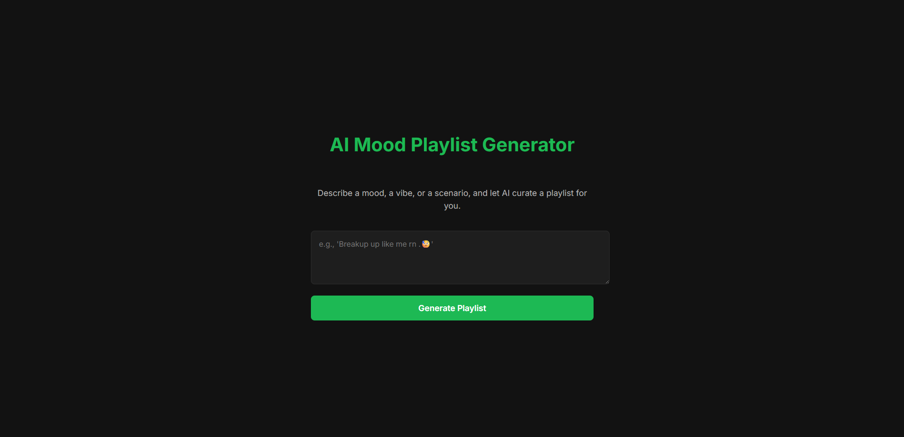
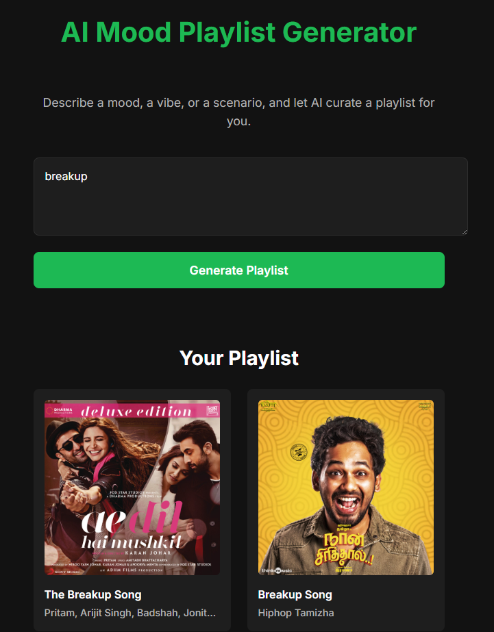
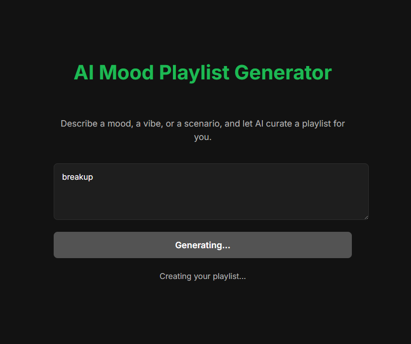

# AI Mood Playlist Generator

## Project Description

The AI Mood Playlist Generator is a web application that creates Spotify playlists based on a user's mood. Users can describe a mood, a vibe, or a scenario, and the application will use a generative AI to create a playlist of songs that match the description.

## Screenshots




## Setup Instructions

To run this project locally, you will need to have Node.js and npm installed.

### Backend

1.  Navigate to the `backend` directory:
    ```bash
    cd backend
    ```
2.  Install the dependencies:
    ```bash
    npm install
    ```
3.  Create a `.env` file and add the following environment variables:
    ```
    GOOGLE_API_KEY=your_google_api_key
    SPOTIFY_CLIENT_ID=your_spotify_client_id
    SPOTIFY_CLIENT_SECRET=your_spotify_client_secret
    ```
4.  Start the backend server:
    ```bash
    node index.js
    ```
    The backend server will be running on `http://localhost:3001`.

### Frontend

1.  Navigate to the `frontend` directory:
    ```bash
    cd frontend
    ```
2.  Install the dependencies:
    ```bash
    npm install
    ```
3.  Start the frontend development server:
    ```bash
    npm run dev
    ```
    The frontend will be running on `http://localhost:5173` (or another port if 5173 is busy).

## Technology Stack

### Backend

*   **Node.js**
*   **Express**
*   **@google/generative-ai** for generating the playlist
*   **spotify-web-api-node** for fetching track information from Spotify
*   **cors** for enabling Cross-Origin Resource Sharing
*   **dotenv** for managing environment variables

### Frontend

*   **React**
*   **Vite** for the development server and build tool
*   **ESLint** for linting

## Features Implemented

*   **Mood-based playlist generation:** Users can input a mood, and the AI will generate a playlist to match.
*   **Spotify integration:** The generated playlist includes links to the songs on Spotify.
*   **Responsive design:** The application is designed to work on both desktop and mobile devices.

